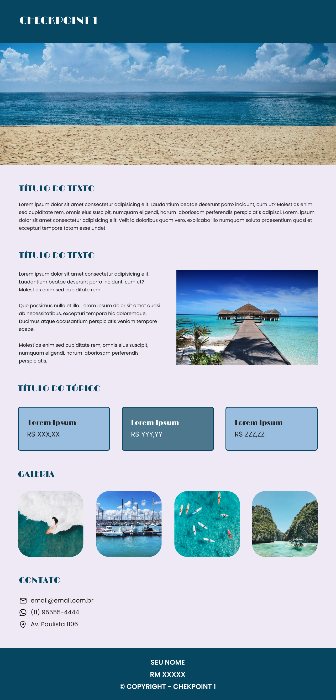

# 🏖️ FIAP - Checkpoint 1: Front-End Design


Este repositório contém a solução desenvolvida para o **Checkpoint 1** da disciplina de **Front-End Design** do curso de **Engenharia de Software** na **FIAP**.

## 📌 Sobre o Projeto

O objetivo do projeto foi reproduzir com precisão o layout de uma *landing page* temática (turismo/viagens) fornecida pela professora, aplicando conceitos fundamentais de desenvolvimento web, tais como:

* Estruturação semântica em **HTML5**.
* Estilização e alinhamentos modernos com **CSS3**.
* Consistência visual de tipografia, espaçamentos e paleta de cores.

## 📸 Layout de Referência

O projeto foi construído tomando como base o protótipo visual abaixo:

<div align="center">
  
</div>

## 🗂️ Estrutura da Página

A *landing page* é composta pelas seguintes seções:

1. **Header:** Cabeçalho simples com a identificação do checkpoint.
2. **Banner:** Imagem principal em destaque (paisagem praiana).
3. **Seções de Texto:** Blocos descritivos com textos institucionais e imagens laterais.
4. **Cards de Tópicos / Preços:** Grade contendo 3 destaques/planos em caixas personalizadas.
5. **Galeria:** Exibição de 4 imagens temáticas com cantos arredondados (`border-radius`).
6. **Contato:** Informações de e-mail, telefone e endereço acompanhadas por ícones.
7. **Footer:** Rodapé contendo o nome dos integrantes, RM e aviso de Copyright.

## 🛠️ Tecnologias Utilizadas

* **[HTML5](https://developer.mozilla.org/pt-BR/docs/Web/HTML):** Marcação e estruturação semântica das seções.
* **[CSS3](https://developer.mozilla.org/pt-BR/docs/Web/CSS):** Estilização, regras de layout (Flexbox), paleta de cores e tipografia.

## 🚀 Como Executar o Projeto

Como o projeto foi desenvolvido apenas com tecnologias nativas (*vanilla*), não é necessário instalar dependências.

1. **Clone o repositório:**
   ```bash
   git clone https://github.com/lucas-dos-santos-gomes/FIAP-front-end-checkpoint1.git
   ```

2. **Navegue até o diretório do projeto:**
   ```bash
   cd FIAP-front-end-checkpoint1
   ```

3. **Abra o projeto no navegador:**
   * Basta dar um duplo clique no arquivo `index.html`, ou abrir o arquivo em seu navegador de preferência.
   * Se estiver utilizando o **VS Code**, pode utilizar a extensão **Live Server** para rodar localmente.

Caso não queira fazer todo esse processo, pode acessar o link do projeto hospedado na Web: https://lucas-dos-santos-gomes.github.io/FIAP-front-end-checkpoint1/

## 👥 Dupla Desenvolvedora

| Aluno | RM | GitHub | LinkedIn |
| :--- | :---: | :---: | :---: |
| **Lucas dos Santos Gomes** | `RM576912` | [@lucas-dos-santos-gomes](https://github.com/lucas-dos-santos-gomes) | [LinkedIn](https://linkedin.com/in/lucas-santos-gomes) |
| **David Manoel Barros Pereira** | `RM576915` | [@DKplayerKS](https://github.com/DKplayerKS) | [LinkedIn](https://linkedin.com) |

---

<div align="center">
  <p>Desenvolvido por Lucas e David, alunos da FIAP</p>
</div>